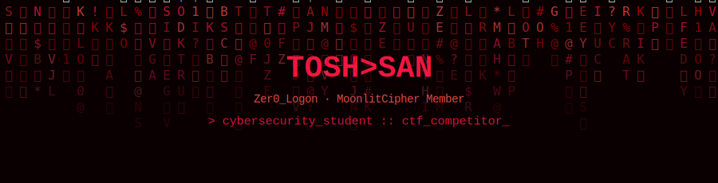
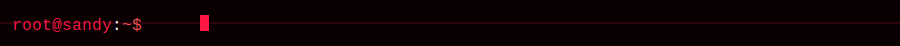

<p align="center">
  SAN banner" />
</p>

<p align="center">
  <a href="https://santhoshdodo2721.github.io/S-NDY/"></a>
  
  
</p>

<p align="center">
  
</p>



### `[ ABOUT ]`

```bash
> cat about.txt

  I'm SanthoshKumar.S, a Cybersecurity student at Sri Shakthi Institute
  of Engineering and Technology.

  Passionate about understanding how systems work and how to secure
  them against evolving threats. I actively explore network security,
  ethical hacking, web application security, and cryptography — and
  compete in CTF challenges to sharpen problem-solving in real-world
  scenarios.

  Mission: build relentless technical depth and contribute to a
  safer digital world.
```


### `[ GITHUB_PROFILE_ANALYSIS ]`

```bash
> ./analyze.sh santhoshdodo2721

  [+] Public repositories ......... 4
  [+] Stars earned ................ 1
  [+] Account tier ................ Pro (Developer Program Member)
  [+] Primary languages ........... Python, HTML
  [+] Repo focus ................... offensive-security tooling + writeups
```

**What the repos say about your GitHub identity:**

- **`Helio_The-Recon-Tool`** and **`Try-Me-phishing-simulation`** (Python) are your core technical projects — both are hands-on security tools, not tutorials or clones, which signals genuine builder activity rather than a learning-in-public account.
- **`S-NDY`** (HTML) is your live portfolio site — pairing a profile README with a deployed portfolio is a strong combo most student profiles don't have.
- **`Writeups`** shows you document what you learn — recruiters and CTF teams specifically look for this.
- Your repo count is low (4) but every repo has a clear purpose — no dead forks or empty scaffolds. That's a positive signal, but adding 2–3 more small projects (a CVE lab writeup, a Burp Suite extension, a small CTF solver script) would round out the language spread beyond just Python/HTML.
- 1 star total means discoverability is low — a sharp README (this one), topics/tags on your repos, and sharing Helios on r/OSINT or Hacker News would help visibility more than adding more repos would.

<p align="center">
  
</p>


### `[ SKILLS & TOOLS ]`

<p align="center">
  
  
  
  
  
  
</p>

<p align="center">
  
</p>


### `[ SYSTEM_METRICS ]`

<p align="center">
  
  
</p>

<p align="center">
  
</p>


### `[ CONNECT ]`

<p align="center">
  <a href="mailto:santhoshsivgom@gmail.com"></a>
  <a href="https://www.linkedin.com/in/santhosh-kumar-13a419338"></a>
  <a href="https://github.com/santhoshdodo2721"></a>
  <a href="https://santhoshdodo2721.github.io/S-NDY/"></a>
</p>

<p align="center">
  
</p>
