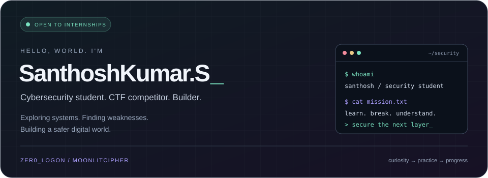
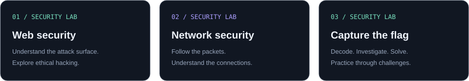
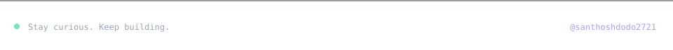

  

  
  &nbsp;
  
  &nbsp;
  

 

### 01 / Behind the terminal

I'm **SanthoshKumar.S**, a cybersecurity student at **Sri Shakthi Institute of Engineering and Technology**. I explore how systems work, where they break, and how to secure them.

My interests span **network security, ethical hacking, web application security, and cryptography**. CTF challenges are where I put that curiosity into practice.

> Build technical depth. Think like an attacker. Create a safer digital world.

 

  

### 02 / My toolkit

**Languages & web**

  
  
  
  
  

**Security & analysis**

  
  
  
  

**Development & monitoring**

  
  
  
  

 

### 03 / Find me in the field

| Focus | What drives me |
| :--- | :--- |
| **CTF challenges** | Solving puzzles and sharpening practical problem-solving skills. |
| **Community** | Zer0_Logon · MoonlitCipher member. |
| **Next chapter** | Open to internships and opportunities to learn, build, and contribute. |

 

### 04 / Let's connect

Have an internship opportunity, a security challenge, or an idea to build together? **[Drop me a message](mailto:santhoshsivgom@gmail.com)**.

[Portfolio](https://santhoshdodo2721.github.io/S-NDY/) &nbsp; / &nbsp; [LinkedIn](https://www.linkedin.com/in/santhosh-kumar-13a419338) &nbsp; / &nbsp; [GitHub](https://github.com/santhoshdodo2721)

 

  

